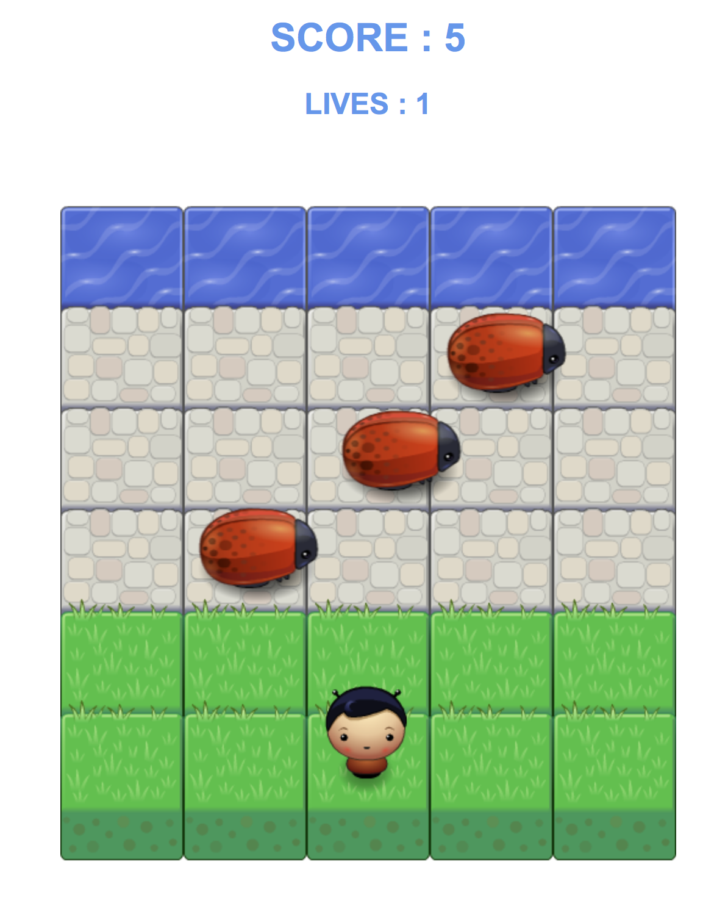

# Memory Game

This game will put your hand and eye coordinatin skills to the test.

<hr>



<hr>

## Goal
The goal of the game is to cross our player boy safely to the top without colliding from any marauding bug.

## Try it

[https://jprime81.github.io/classic-arcade-game/](https://jprime81.github.io/classic-arcade-game/)

## Game mechanics

- Use your keyboard's arrow key to move up, down, left, and right

- Avoid the wandering and speeding bugs to reach the top and score

- Score is tallied when you reach the top

- Score is reset once all lives are spent

## Running the game
To run the game, just do the following:

1. Clone or download the project:

    ```
    https://github.com/jprime81/classic-arcade-game.git
    ```

2. Locate and unzip the project file.


3. Open the game by double-clicking the index.html file:
